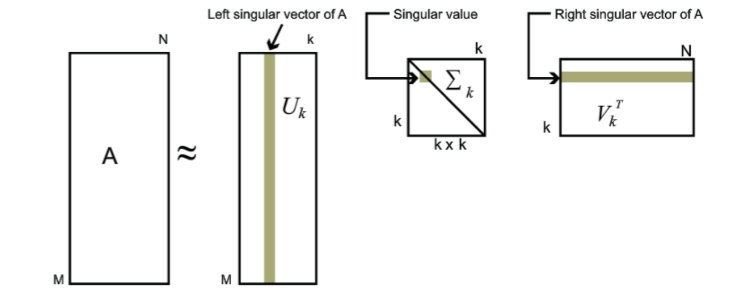
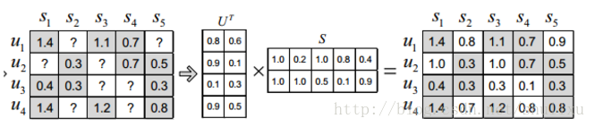

## 二、典型任务和算法（模型）

### 1.相似匹配（基于内容）

1.1 标签匹配

1.1 LDA主题模型

### 2.评分预测

#### 2.1.large scale 问题。为什么不直接进行回归预测呢？

>表示学习（用户、物品）+相似匹配

#### 2.2.user or item based 协同过滤

    以user-based协同过滤为例：找出与当前User i最相似的N个User，并根据N个User对Item的打分估计 i 对该Item的打分。相似度采用jaccard similarity 或 Cosine Similarity：

$$ \qquad sim(x,y) = \frac {r_x \cap r_y}{r_x \cup r_y}$$

$$ \qquad sim(x,y) = 1- cosine(x,y) = 1 - \frac{ A \cdot B}{\mid\mid A\mid\mid \ \mid\mid B\mid\mid}$$

#### 2.3.矩阵分解(model-based 协同过滤)：
2.3.1.SVD(PCA):

    奇异值分解，通过降维的方法来补全用户-物品评分矩阵，对矩阵中没有出现的值进行估计。缺点是分解前需补全R矩阵的缺失值（比如用全局平均值或用户、物品平均值进行补全），耗费存储大；计算复杂度高。
    
$$ \qquad R' = U_{m\times m}S_{m\times n}V_{n \times n}^T $$ 

   
2.3.2.ALS:

    交替最小二乘梯度下降
    

    
$$ \qquad R' = X_{m \times k}Y_{n \times k}^T$$
$$ \qquad L_{exp} = \sum\limits_{u,i \in S}(r_{ui} - \textbf{x}_{u}^{\intercal} \cdot{} \textbf{y}_{i})^{2} + \lambda_{x} \sum\limits_{u} \left\Vert \textbf{x}_{u} \right\Vert^{2} + \lambda_{y} \sum\limits_{u} \left\Vert \textbf{y}_{i} \right\Vert^{2}$$
   
    求解方式固定X求Y，固定Y求X
   
$$ \qquad x_u=(Y^TY+\lambda I)^{−1}Y^Tr(u)$$
$$ \qquad y_i=(X^TX+\lambda I)^{−1}X^Tr(i)$$
   
    支持隐反馈数据（0,1）（加权的正则化矩阵分解）[1]
   
$$ \qquad L_{WRMF} = \sum\limits_{u,i}c_{ui} \big( p_{ui} - \textbf{x}_{u}^{\intercal} \cdot{} \textbf{y}_{i} \big) ^{2} + \lambda_{x} \sum\limits_{u} \left\Vert \textbf{x}_{u} \right\Vert^{2} + \lambda_{y} \sum\limits_{u} \left\Vert \textbf{y}_{i} \right\Vert^{2} $$   
$$ \qquad c_{ui} = 1 + \alpha d_{ui}$$  
$$ \qquad x_{u} = (Y^{T}C^{u}Y + \lambda I )^{ - 1 }Y^{T}C^{u}r(u)$$  
$$ \qquad y_{i} = (X^{T}C^{i}X + \lambda I )^{ - 1 }X^{T}C^{i}r(i)$$
 
2.3.3.PMF

    Probabilistic Matrix Factorization概率矩阵分解[2]

    传统的协同过滤方法既不能处理大数据量的推荐，也不能处理只有很少评分的用户。这篇论文提出了著名的概率矩阵分解的方法来解决这个问题。概率矩阵分解的思想是以中线性因子模型，它使用与用户相关的系数，将用户的偏好建模成一个一系列向量的线性组合。
    
    [博文](https:/blog.csdn.net/shenxiaolu1984/article/details/50372909)
    
2.3.4.BPMF

    Bayesian Probabilistic Matrix Factorization贝叶斯概率矩阵分解[3]
    
    本论文的模型和前文类似，但在求解时，是从贝叶斯角度而不是传统概率角度出发：不再把系统参数当做一个固定值估计，而是作为一个服从某种分布的随机变量，转而估计该分布的参数。

#### 2.4.基于特征+矩阵分解：

    物品特征、用户特征、用户行为特征
2.4.1.SVD++（加入用户偏执的SVD）
$$ \qquad R' = B_i + B_u + X_{m \times k}Y_{n \times k}^T$$
   
2.4.2.SVDFeature[4]
   > SVDFeature是由Apex Data & Knowledge Management Lab在KDD CUP11竞赛中开发出来的工具包。它的目的是有效地解决基于特征的矩阵分解
   
    三种激活函数（预测值的转换）与损失函数，可应用于回归与二分类。 TODO
$$ \qquad R' = \mu + (\sum_{j}b_j^{(g)} \gamma_j + \sum_{j}b_j^{(u)} \alpha_j + \sum_{j}b_j^{(i)} \beta_j) + (\sum_j p_j)^T (\sum_j q_j\beta _j), \qquad \alpha表示用户特征，\beta表示商品特征，\gamma表示全局特征$$
  
2.4.3.FM

    Factorization Machine 因子分解机[5]，解决稀疏数据下的特征组合问题，多种激活函数与损失函数可以应用于比如回归、分类、排序。 TODO
$$ \qquad R' = w_0 + \sum_{i=1}^{n}w_i x_i + \sum_{i=1}^{n}\sum_{j=i+1}^n<V_i,V_j>x_i x_j $$ 
   
2.4.4.FFM[6]
   
    在FM模型中，每一个特征会对应一个隐变量，但在FFM模型中，认为应该将特征分为多个field，每个特征对应每个field分别有一个隐变量。也就是说，“Day=26/11/15”这个特征与“Country”特征和“Ad_type"特征进行关联的时候使用不同的隐向量，这与“Country”和“Ad_type”的内在差异相符，也是FFM中“field-aware”的由来。
$$ \qquad R' = w_0 + \sum_{i=1}^{n}w_i x_i + \sum_{i=1}^{n}\sum_{j=i+1}^n<V_{i,f_j},V_{j,f_i}>x_i x_j $$
   
2.4.5 DPMF[7]
   
    依赖辅助特征的矩阵分解Dependent Probabilistic Matrix Factorization
   
    与PMF类似，加入了一些经过高斯处理的特征信息
   
2.4.6.Collaborative Topic Modeling（LDA+协同）（内容+行为）[8]

    基于协同的推荐只会推荐旧的物品，不能泛化到新物品。因此该模型结合内容与行为提高模型的泛化能力。
   
   >在[8]中，作者通过引入隐含变量将主题模型与矩阵分解（PMF）相结合，将item的隐变量替换成了item主题向量$\theta_j$与隐向量$\xi_j$的加和$v_j = \theta_j + \xi_j$，其中隐向量决定了推荐对新旧物品的偏执

### 3.排序

#### 3.1.评估：CTR（点击率）、CVR（转化率）、停留时长、Rank、...
#### 3.2.模型：
    LR、GBDT、GBDT+LR、xgboost、LGBM、FM / FFM ...

### 4.序列预测
   上述皆是基于用户与物品的点对推荐模式，并没有充分考虑物品的时序关系
#### 4.1.基于session的特征：
   短期偏好、意图识别,
#### 4.2.基于session的模型（可作召回或端到端推荐）：
   马尔科夫决策过程[9]、隐马尔科夫、条件随机场

[1] Hu Y, Koren Y, Volinsky C. Collaborative filtering for implicit feedback datasets[C] Mining, 2008. ICDM'08. Eighth IEEE International Conference on. Ieee, 2008: 263-272.

[2] R. Salakhutdinov and A. Mnih. Probabilistic matrix factorization. Advances in Neural Information Processing Systems, 20:1257–1264, 2008.

[3] Salakhutdinov R, Mnih A. Bayesian probabilistic matrix factorization using Markov chain Monte Carlo[C]/Proceedings of the 25th international conference on Machine learning. ACM, 2008: 880-887.

[4] Chen T, Zhang W, Lu Q, et al. SVDFeature: a toolkit for feature-based collaborative filtering[J]. Journal of Machine Learning Research, 2012, 13(Dec): 3619-3622.

[5] Rendle S. Factorization machines with libfm[J]. ACM Transactions on Intelligent Systems and Technology (TIST), 2012, 3(3): 57.

[6] Juan Y, Zhuang Y, Chin W S, et al. Field-aware factorization machines for CTR prediction[C]/Proceedings of the 10th ACM Conference on Recommender Systems. ACM, 2016: 43-50.

[7] Adams, Ryan Prescott, George E. Dahl, and Iain Murray. “Incorporating 
side information in probabilistic matrix factorization with gaussian 
processes.” arXiv preprint arXiv:1003.4944 (2010).

[8] Wang C, Blei D M. Collaborative topic modeling for recommending scientific articles[C]/Proceedings of the 17th ACM SIGKDD international conference on Knowledge discovery and data mining. ACM, 2011: 448-456.

[9] Markov decision Processes （MDPs）（Shani et al., 2002）